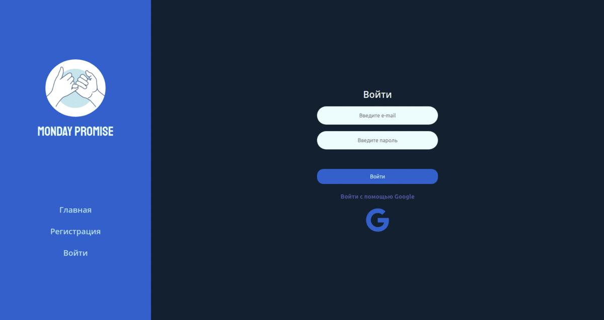

# Monday Promise

## What is Monday Promise?

Monday Promise is a platform to publish your promises to yourself, kind of a social network for those who want to achieve their goals.
It's hard to keep your promise when you're the only one who knows about it, so Monday Promise is here to help.

## Features

* Email or Google authentication
* Main page - your friends' promises feed, each of them has a deadline, description and "why" - user's motivation.
* You can comment and bet on someone's promise if you believe it will be kept or not.
* Your promises can be found on your account page, active and finished, successful and failed.
* Each kept promise brings you points and your friendlist is also a leaderboard. Achieve your goals and get to the top!

## Tech stack

- Frontend - React.js, CSS, Bootstrap.
- Backend - Firebase (Firestore, Authentication, Hosting)
- Teamwork - Trello, Github, Slack

## Roadmap

- Mobile app on React Native.
- Report system so user could post about his progress on achieving his goal. Photo or text or even video to prove that you did that small step towards better self today.
- Polishing motivation scheme - user needs to be controlled by "goal buddy", publish reports and get a deserved reward at the end.
